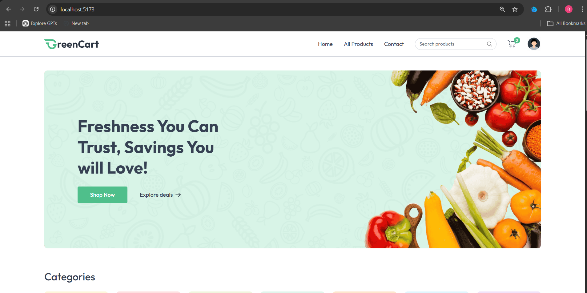
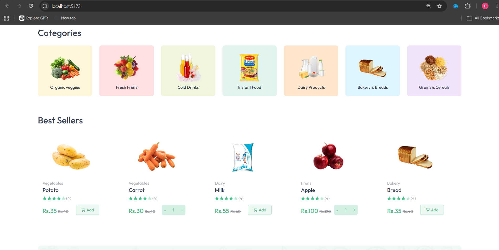
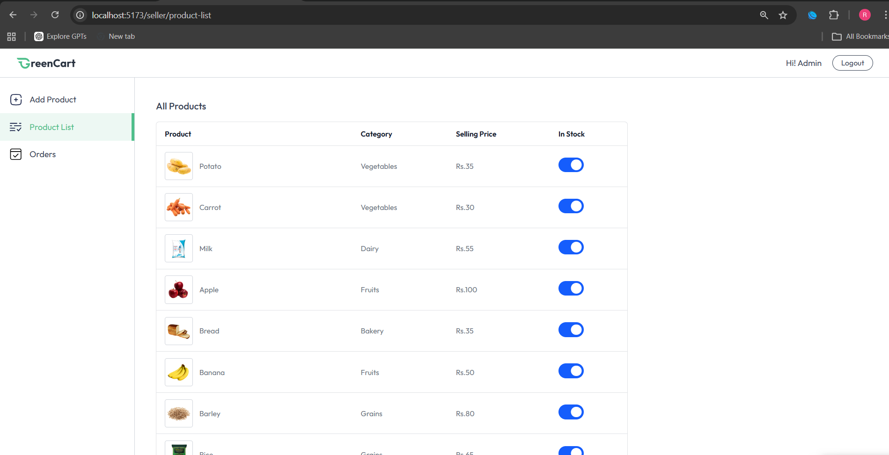
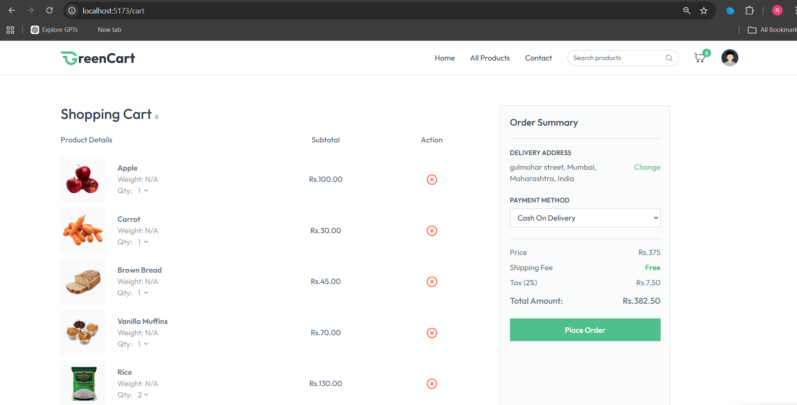
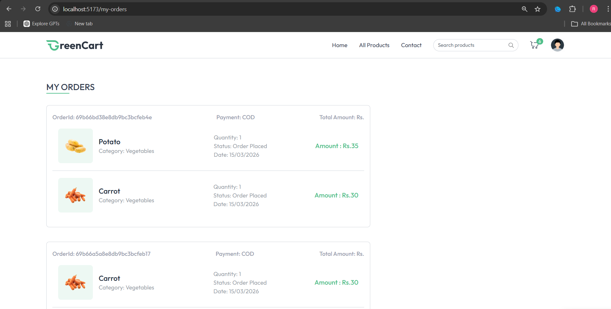
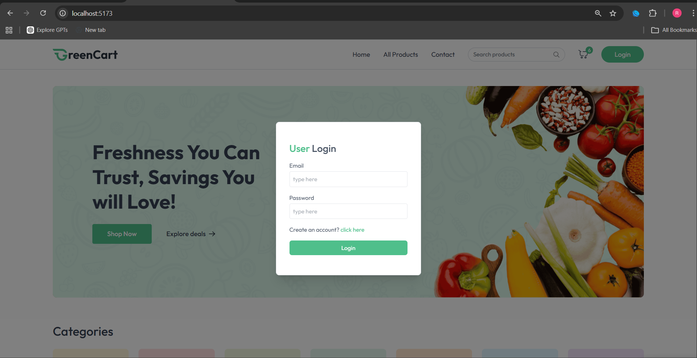
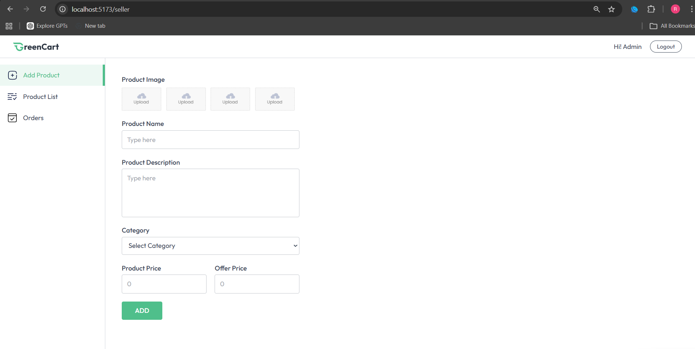
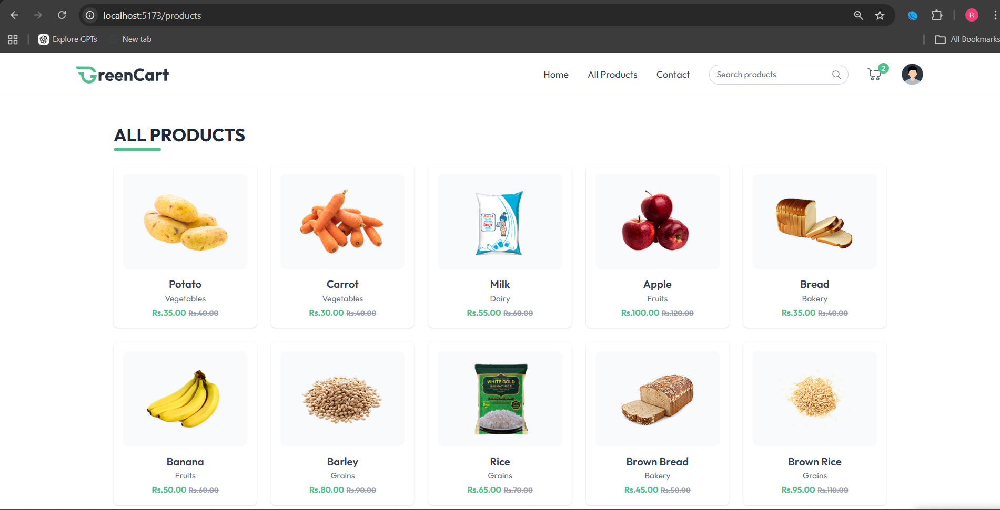
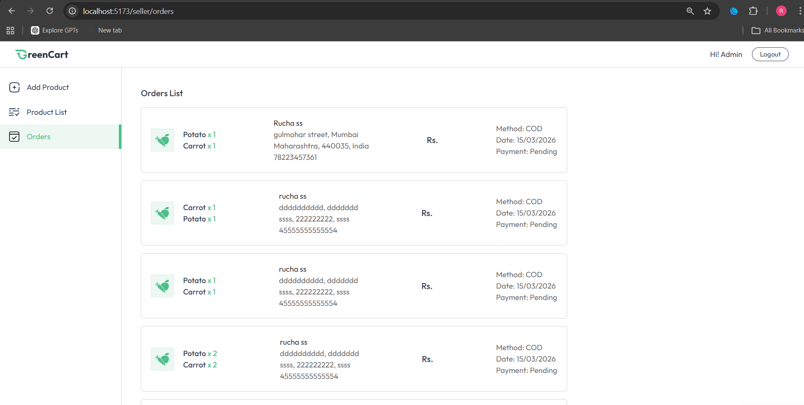
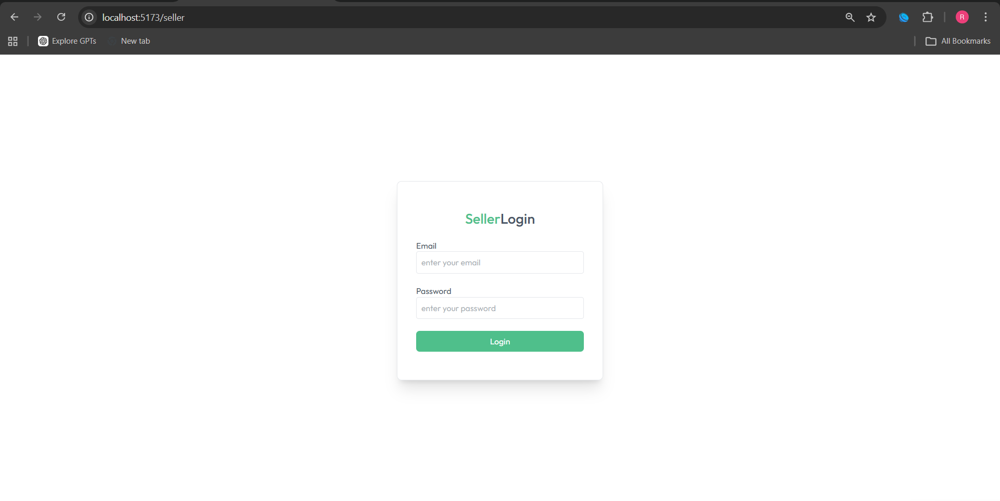

# GreenCart

**GreenCart** is an online grocery platform built with the MERN stack. Users can browse, search, and purchase groceries online. Sellers can add products and manage stock.

---

## Features

- **User Features**
  - User registration and authentication
  - Browse products by category
  - Search and filter products
  - Add products to cart and checkout
  - View previous orders in **My Orders**
  - Manage shipping addresses

- **Seller Features**
  - Seller authentication and dashboard
  - Add, edit, and delete products
  - Upload product images
  - Manage stock automatically
  - View and manage orders

- **Common Features**
  - Product offers and discounts
  - Stock updates automatically when an order is placed
  - JWT-based authentication with hashed passwords
  - Role-based access control

---

## Database Structure

The app uses **MongoDB** with the following main collections:  

1. **Users** – stores user and seller/admin information  
2. **Products** – stores product details including name, price, stock, category, offers, and images  
3. **Orders** – stores order details and status  
4. **Addresses** – stores user shipping addresses  

---

## Tech Stack

**Frontend:**  
- React  
- TailwindCSS  

**Backend:**  
- Node.js  
- Express  

**Database:**  
- MongoDB  

**Libraries / Tools:**  
- axios  
- react-router-dom  
- react-hot-toast  
- cookie-parser  
- jsonwebtoken  
- bcryptjs  
- cors  
- dotenv  
- mongoose  
- multer (for image uploads)  

---

## Screenshots

**User View:**  

  
  
  
  
  
  

**Seller/Admin View:**  

  
  
  

---

# GreenCart Setup Instructions

# 1. Backend (server)

# Clone the repository
git clone https://github.com/RuchaSahare/greencart.git
cd greencart/server

# Install dependencies
npm install

# Create a .env file in the server folder with:
# (replace with your actual MongoDB URI and JWT secret)
echo "PORT=5000
MONGO_URI=your_mongodb_connection_string
JWT_SECRET=your_jwt_secret" > .env

# Start the backend server
npm run dev

# 2. Frontend (client)

# Navigate to the client folder
cd ../client

# Install dependencies
npm install

# Start the React app
npm start

# 3. Folder Structure

# greencart/
# ├── client/ # React + Tailwind frontend
# │   ├── src/
# │   │   ├── assets/
# │   │   │   ├── logo.svg
# │   │   │   └── screenshots/
# │   │   ├── components/
# │   │   ├── context/
# │   │   ├── pages/
# │   │   ├── App.jsx
# │   │   ├── main.jsx
# │   │   └── index.css
# │   ├── node_modules/
# │   └── package.json
# ├── server/ # Node.js + Express backend
# │   ├── configs/
# │   ├── controllers/
# │   ├── middlewares/
# │   ├── models/
# │   ├── routes/
# │   ├── uploads/
# │   ├── node_modules/
# │   ├── .env
# │   └── server.js
# ├── README.md
# └── package.json